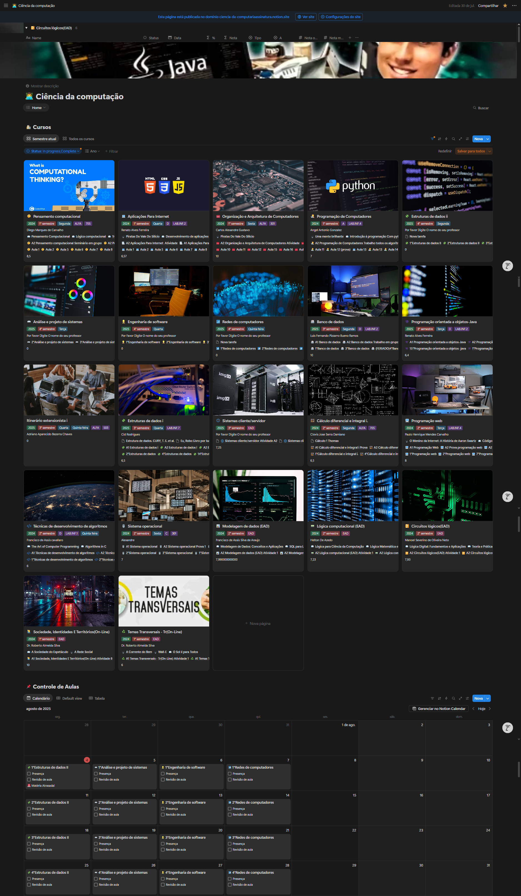

# 🎓 Dashboard Quantum Smart (DQS)

Este `README.md` documenta o **Dashboard Quantum Smart (DQS)**, um sistema de produtividade e gestão acadêmica completo, desenvolvido na plataforma Notion. O painel foi projetado para ser o centro de controle da minha jornada no curso de Ciência da Computação, unificando disciplinas, notas, materiais de estudo e desenvolvimento profissional em um ecossistema inteligente e fácil de navegar.
Screenshot

## 🎯 Objetivos do Projeto

* **Centralização Total:** Consolidar 100% das informações acadêmicas, eliminando a necessidade de usar múltiplas ferramentas.
* **Produtividade Ativa:** Transformar a organização de uma tarefa reativa em um processo proativo, liberando tempo para focar no aprendizado.
* **Rastreamento de Progresso:** Manter um registro claro do desempenho acadêmico, projetos práticos e desenvolvimento de habilidades.
* **Criação de um Portfólio Dinâmico:** Manter um acervo de projetos e certificados sempre atualizado e pronto para ser compartilhado.

## ✨ Funcionalidades Principais

* **Gestão de Cursos e Histórico:** O sistema rastreia tanto o semestre atual quanto o histórico de todos os cursos já concluídos, exibindo status como "Em andamento" ou "Aprovado" e as notas finais.
* **Sistema de Avaliação Inteligente:** Um banco de dados dedicado para "Atividade valendo nota" registra provas e trabalhos. Utiliza a função `Rollup` do Notion para calcular e exibir automaticamente a nota total de cada matéria na página principal do curso.
* **Controle de Aulas e Alertas:** Um banco de dados para cada aula permite o acompanhamento de presença e revisões. Uma fórmula personalizada exibe um alerta "🚨 Matéria Atrasada!" para aulas passadas que precisam de atenção.
* **Portfólio Dinâmico:** Galerias visuais para exibir "Projetos feitos" e uma seção organizada para todos os "Certificados" adquiridos, funcionando como um currículo vivo.
* **Base de Conhecimento:** Uma seção de "Material a Mais" cataloga livros, artigos, vídeos e outros recursos de estudo complementares.

## 💻 Tecnologias e Conceitos Utilizados

* **Notion (Segundo Cérebro):** A plataforma central onde todo este "Segundo Cérebro" digital foi projetado e implementado.
* **Bancos de Dados Relacionados:** A espinha dorsal do sistema, conectando Cursos com Aulas e Atividades para criar uma rede de informações coesa.
* **Notion Formula Language:** A tecnologia por trás das automações, alertas e cálculos personalizados que dão inteligência ao painel.

## 📂 Estrutura do Painel

A arquitetura do painel é organizada de forma hierárquica para facilitar a navegação, espelhando a estrutura do workspace:

* **🎓 Ciência da computação** (Página Raiz)
    * **📚 Cursos**: Banco de dados central com visualizações para o "Semestre atual" e "Todos os cursos".
    * **📌 Controle de Aulas**: Gerenciador de cronograma com visualizações em "Calendário", "Tabela" e padrão.
    * **⏰ Atividade valendo nota**: Banco de dados para avaliações, com múltiplas visualizações como "Tarefas", "Calendário" e "Cronograma".
    * **📰 Material a Mais**: Biblioteca para recursos de estudo.
    * **🥇 Projeto feitos**: Portfólio de projetos práticos.
    * **linkedin Linkdin plano**: Seção para planejamento de carreira no LinkedIn.
    * **📄 Visualização de Cursos**: Área dedicada para análise de performance, como o "Boletim".
    * **💼 Site de trabalhos**: Um hub com links para plataformas de emprego.
    * **📜 Certificados**: Arquivo de todas as certificações profissionais.

## 🚀 Fluxo de Trabalho e Uso

Este painel foi projetado para um fluxo de trabalho dinâmico e inteligente. Após a configuração inicial, a rotina de uso é a seguinte:

1.  **Aprimoramento de Aulas com IA:**
    * **Captura:** Durante a aula, a ferramenta de transcrição por voz do sistema operacional (**Win + H**) é ativada para gerar um registro textual do conteúdo diretamente na página da aula no Notion.
    * **Refinamento:** A transcrição é fornecida a um Modelo de Linguagem (LLM) com um prompt otimizado, que reescreve o texto para ser mais claro, detalhado e didático.
    * **Armazenamento:** O conteúdo aprimorado pela IA é salvo de volta na página da aula, criando um material de estudo de alta qualidade para revisões futuras.
2.  **Gestão Diária:**
    * Acesso o painel para uma visão geral das aulas e atividades do dia.
    * Marco a presença e a revisão no **Controle de Aulas**, mantendo o sistema de alertas atualizado.
    * Registro novas notas no banco de dados de **Atividade valendo nota** para que o sistema as calcule automaticamente na média da matéria.

## 🛠 Melhorias Futuras

* **Automação do Fluxo de IA:** Desenvolver um script ou usar uma ferramenta de automação para enviar transcrições automaticamente para uma API de LLM e salvar o resultado de volta no Notion, eliminando o trabalho manual.
* **Plataforma Web Independente:** Como um objetivo de longo prazo, recriar a dinâmica deste painel em um website próprio para obter controle total sobre a funcionalidade e a interface do usuário.
* **Sistema de Revisão Espaçada:** Implementar fórmulas mais complexas para criar um sistema de repetição espaçada que sugere automaticamente o momento ideal de revisar conteúdos antigos para maximizar a retenção de conhecimento.

---

## 📝 Licença

Este projeto está sob a licença MIT. Para mais detalhes, consulte o arquivo `LICENSE`
